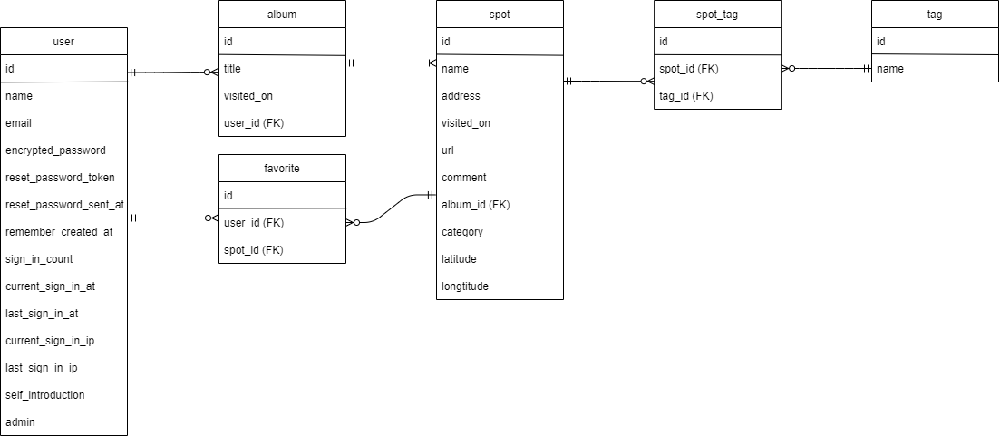

# README

**開発言語**
****
* Ruby 3.0.1
* Rails 6.1.7
<br>

**就業Termの技術**
****
* devise
* AWS
* お気に入り機能
<br>

**カリキュラム外の技術**
****
* geocoder（Google Mapの活用）
* Active Storage
<br>

**実行手順**
****
```
$ git clone git@github.com:aynminoa/original_app.git
$ cd original_app
$ bundle install
$ rails db:create && rails db:migrate
$ rails s
```
<br>

**カタログ設計**
****
https://docs.google.com/spreadsheets/d/1sOg2eGdqihjT57-3wPAyFAeE2SoGIXclCDoSNft2xIM/edit?usp=sharing
<br>

**テーブル定義書**
****
https://docs.google.com/spreadsheets/d/1sOg2eGdqihjT57-3wPAyFAeE2SoGIXclCDoSNft2xIM/edit?usp=sharing
<br>

**ワイヤーフレーム**
****
https://onl.la/XX3Jj3y
<br>

**ER図**
****

<br>

**画面遷移図**
****


